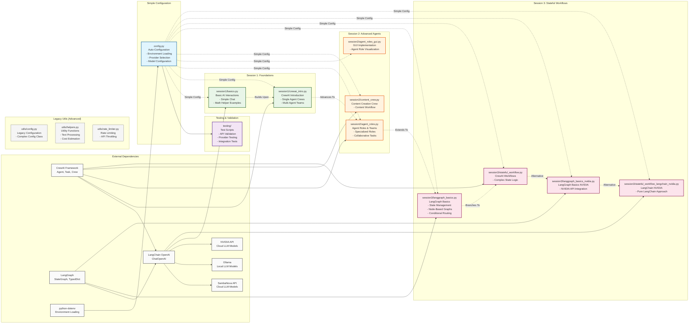

# AIAgentWorkshop Code Architecture

This document provides a visual representation of the codebase architecture using Mermaid diagrams.

## Project Overview

The AIAgentWorkshop is a Python-based educational project demonstrating progressive AI agent development, from basic interactions to complex multi-agent workflows. It supports multiple AI providers (SambaNova cloud API, Ollama local models, and NVIDIA API) with a simple configuration system.

## Architecture Diagram

## Component Descriptions

### Simple Configuration System
The `config.py` file provides automatic configuration loading:

- **Provider Selection**: Choose between SambaNova (cloud) or Ollama (local)
- **Auto-Loading**: Environment variables loaded automatically on import
- **Easy Imports**: Direct access via `from config import API_KEY, MODEL, etc.`
- **Validation**: Basic key format checking and defaults

### Testing Infrastructure
The `testing/` folder contains validation and testing scripts:

- **test_langchain.py**: LangChain integration tests
- **test_nvidia_langchain.py**: NVIDIA API with LangChain tests
- **test_nvidia_model.py**: Direct NVIDIA model tests
- **test_ollama.py**: Ollama local model tests
- **test_sambanova.py**: SambaNova API tests
- **API Testing**: Validate connections to different providers
- **Integration Tests**: End-to-end workflow testing
- **Provider Validation**: Ensure API keys and models work correctly

### Session Progression
The workshop follows a progressive learning path:

1. **Session 1**: Foundation concepts with basic AI interactions and CrewAI introduction
2. **Session 2**: Advanced agent design with specialized roles and team collaboration
3. **Session 3**: Complex state management with multiple workflow implementations

### Session 3 Variants
Session 3 demonstrates different approaches to stateful workflows:

- **CrewAI Version**: Traditional multi-agent workflows with state
- **NVIDIA Direct**: Direct integration with NVIDIA API
- **LangChain Pure**: Framework-agnostic LangChain implementation

### External Dependencies
- **LangChain**: Framework for building LLM-powered applications
- **CrewAI**: Framework for creating multi-agent workflows
- **LangGraph**: Library for building stateful agent workflows with graph-based logic
- **SambaNova API**: Cloud-based LLM provider with fast inference
- **Ollama**: Local LLM runtime for running models offline
- **NVIDIA API**: Cloud-based LLM provider with high-performance inference
- **python-dotenv**: Environment variable management

## Data Flow

1. Configuration is loaded automatically from `.env` via `config.py`
2. Sessions import configuration variables directly
3. AI providers (SambaNova/Ollama/NVIDIA) are initialized with appropriate settings
4. Agents execute tasks using external LLM APIs through LangChain/CrewAI/LangGraph
5. Results are processed and presented to users

## Design Patterns

- **Simple Imports**: Direct variable imports instead of complex classes
- **Provider Abstraction**: Unified interface for different AI providers
- **Progressive Complexity**: Sessions build upon each other with increasing sophistication
- **Multiple Implementations**: Session 3 shows different approaches to the same problem
- **Configuration as Code**: Settings defined as simple Python variables

## Provider Support

### SambaNova (Cloud)
- Fast inference with enterprise-grade reliability
- Pay-per-use pricing with generous free tier
- Access to multiple model sizes and capabilities

### Ollama (Local)
- Completely free and offline-capable
- Full control over models and data privacy
- No API rate limits or costs
- Requires local hardware resources

### NVIDIA (Cloud)
- High-performance cloud inference
- Access to advanced NVIDIA models
- Scalable and reliable API service
- Suitable for production workloads
